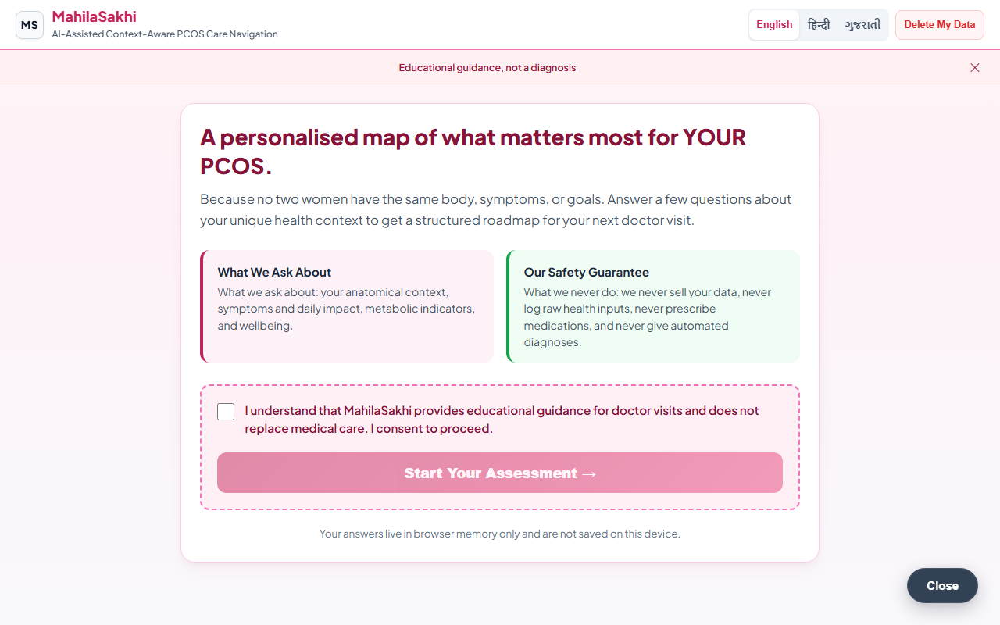
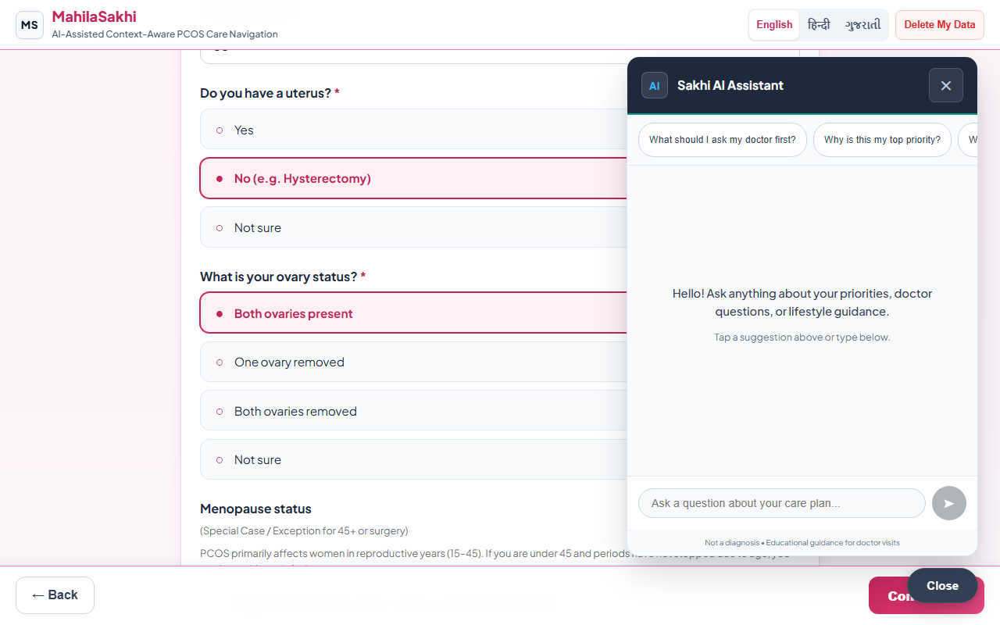
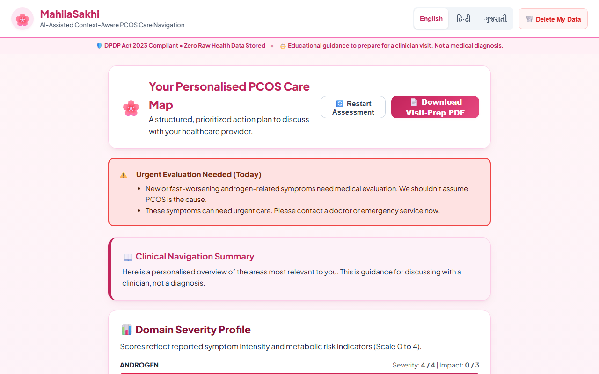
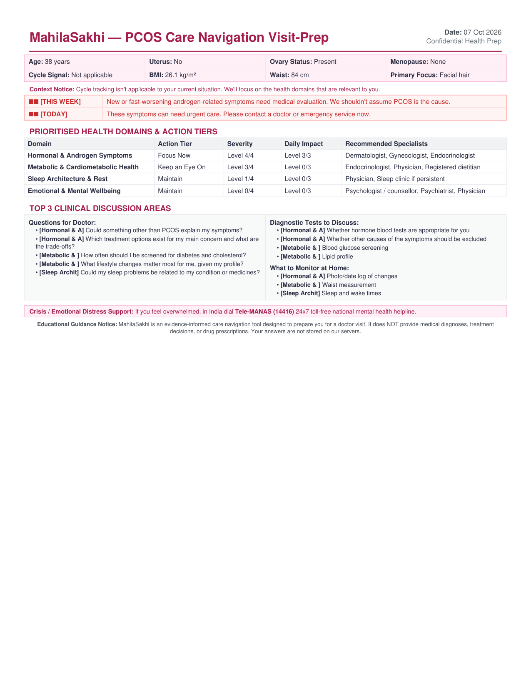
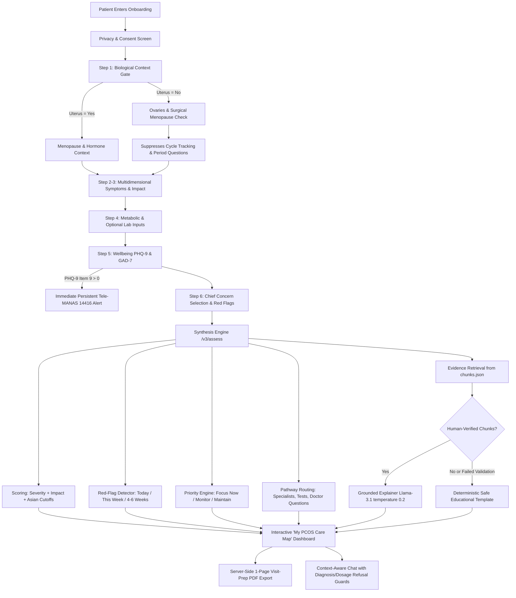

# 🌸 MahilaSakhi v3 – Context-Aware PCOS Care-Navigation Platform

[](https://github.com/diyuworks/MahilaSakhi-PCOD-Predictor/actions/workflows/ci.yml)
[](https://github.com/diyuworks/MahilaSakhi-PCOD-Predictor)
[](docs/privacy.md)
[](https://github.com/diyuworks/MahilaSakhi-PCOD-Predictor)

MahilaSakhi is an evidence-informed, context-aware women's health platform that answers:
> **"Given MY symptoms, reproductive context, health info, goals, and concerns, what should I focus on next?"**

The platform replaces legacy single-form prediction with a validated **care-navigation pipeline**:
**Consent & Privacy Gate → Context Branching (Uterus/Ovaries/Menopause) → Multidimensional Profiling (Severity + Daily Impact) → Domain Prioritisation Engine → Tailored Care Pathway → Verified Guideline Grounding → Single-Page Clinical Visit-Prep Export.**

---

## 📸 Visual Overview

| Landing Screen (Desktop 1280x800) | Hysterectomy Context Branching |
| :---: | :---: |
|  |  |

| Care Map Dashboard with Red-Flag Urgent Banner | High-Res Visit-Prep PDF Export |
| :---: | :---: |
|  |  |

---

## 🚀 Key Capabilities (v3)

* 🛡️ **Privacy Architecture:** Your answers are not stored on our servers. Zero persistent health logging, client-side session state, and one-click data deletion endpoint (`/v3/delete`). See [docs/privacy.md](docs/privacy.md) (`TODO(legal review)`).
* 🧭 **Context Gate Branching:** Dynamically handles hysterectomy, bilateral/unilateral oophorectomy, surgical vs. natural menopause, and hormonal contraception. Cycle tracking questions are suppressed when biologically not applicable.
* 🎯 **Domain Prioritisation & Care Pathways:** Ranks 7 core domains (*Androgen, Menstrual, Metabolic, Fertility, Mental Wellbeing, Sleep, Menopause/Cardiovascular*) into actionable tiers: **Focus now**, **Keep an eye on**, and **Maintain**.
* 🚨 **Red-Flag Escalation Engine:** Identifies acute symptoms and distinguishes rapid androgen changes or postmenopausal bleeding from standard PCOS with tiered clinical urgency (*Today*, *This week*, *In 4–6 weeks*).
* 📋 **Validated Psychological Instruments:** Optional **PHQ-9** and **GAD-7** screening (with zero preselected answers and `null` skip serialization) plus immediate and persistent safety alerts for Tele-MANAS (14416) if thoughts of self-harm are indicated.
* 📄 **Single-Page Visit-Prep PDF:** High-resolution server-side consultation summary export (ReportLab) for structured discussions with healthcare providers.
* 💬 **Context-Grounded Care Map Chat:** Llama 3.1-powered conversational explanations strictly grounded in retrieved evidence chunks, with temperature 0.2 and strict refusal guards against diagnosis and drug prescribing.
* 🌐 **Trilingual Interface:** Complete internationalization in **English**, **Hindi (हिन्दी)**, and **Gujarati (ગુજરાતી)** across all 203 keys:
  * English (`en.json`): Base reference
  * Hindi (`hi.json`): `{"_needs_native_review": true}` (native clinician audit pending)
  * Gujarati (`gu.json`): `{"_needs_native_review": true}` (native clinician audit pending)

---

## 🛠 Tech Stack & Architecture

### Frontend
* **React.js 18** (Modular step components: `ContextStep`, `SymptomsStep`, `ImpactStep`, `MetabolicStep`, `WellbeingStep`, `ConcernStep`)
* **Chart.js & CSS Design Tokens** (WCAG AA compliant, 44px minimum touch targets)
* **Custom i18n Engine** with instant runtime language switching

### Backend & Clinical Engine
* **Flask (Python 3.10+)** with modular v3 blueprints (`backend/v3/`)
* **Scikit-learn Pipeline** with Stratified K-Fold CV & Platt/Sigmoid probability calibration
* **ReportLab** for pixel-precise, one-page vector medical PDF generation
* **Playwright & PyMuPDF** for automated end-to-end multi-viewport screenshot verification

---

## 🧩 Care-Navigation System Architecture



---

## 🛡️ Clinical Safety & Regulatory Design

1. **Non-Diagnostic Imperative:** The app never diagnoses, prescribes, or calculates an arbitrary "PCOS probability" without pelvic ultrasound confirmation.
2. **Context Gate First:** Biological context strictly dictates clinical routing. Hysterectomy or natural/surgical menopause suppresses period tracking advice.
3. **Escalation & Cancer Rule-Out:** Rapidly worsening virilizing symptoms or postmenopausal vaginal bleeding immediately trigger clinical evaluation alerts to exclude androgen-secreting tumors or endometrial hyperplasia.
4. **Crisis Helplines:** If self-harm is indicated on PHQ-9 item 9, an un-dismissible emergency banner connects the patient to India's national crisis helpline (**Tele-MANAS: 14416**).
5. **Zero-Persistence Privacy Architecture:** Your answers are not stored on our servers. Zero third-party analytics; all inputs live in client React state; one-click `/v3/delete` endpoint. See [docs/privacy.md](docs/privacy.md) (`TODO(legal review)` for DPDP Act 2023 formal certification).
6. **Knowledge Base Verification Protocol:** Evidence chunks in `backend/knowledge/chunks.json` must be human-verified by a clinician before the LLM explainer is permitted to cite them:
   ```bash
   python scripts/verify_chunks.py
   ```
   Only an authorized clinician may flip `"verified": true` in `chunks.json`. If unverified, the system strictly falls back to safe deterministic educational templates.

---

## 🔬 Model Limitations & Honest Ablation Study

Early iterations of symptom prediction tools on the Kerala clinical dataset frequently claimed an inflated **~98% diagnostic accuracy** (not reproduced under stratified CV: ~89% accuracy, cause not established). Rigorous clinical audit reveals that high predictive performance is driven almost entirely by **data leakage from transvaginal/pelvic ultrasound variables** (`Follicle No. (L)` and `Follicle No. (R)`).

When pelvic ultrasound findings are omitted, sensitivity/recall drops precipitously:

| Feature Subset | Number of Features | ROC-AUC | Accuracy | Precision | Recall (Sensitivity) |
|---|---|---|---|---|---|
| **Full Clinical Set (Ultrasound + Labs + Symptoms)** | 41 | **0.962** | 89.1% | 0.910 | **0.740** |
| **No Ultrasound (Labs + Symptoms only)** | 36 | 0.886 | 81.9% | 0.800 | 0.593 |
| **No Ultrasound & No Labs (Questionnaire only)** | 25 | 0.885 | 81.7% | 0.791 | 0.605 |
| **Symptoms Only (11 Basic History questions)** | 11 | 0.891 | 83.4% | 0.781 | 0.689 |

### Clinical Implications:
1. **No Ultrasound = No Risk Probability:** PCOS cannot be diagnosed from a questionnaire alone under the 2023 International Evidence-Based Guideline. MahilaSakhi v3 **refuses** to output an arbitrary probability without confirmed ultrasound follicle inputs, routing users to holistic care pathways instead.
2. **Dataset-Specific Caveat:** The observation that `symptoms-only AUC ≈ no-ultrasound AUC` reflects the hospital referral pattern in this dataset (ten hospitals across Kerala) and is **not** evidence that symptoms alone are sufficient in general outpatient or screening settings.
3. **Probability Calibration:** The clinical Random Forest model (`model/pcod_clinical_v3.pkl`) uses Platt/Sigmoid probability calibration inside a 5-fold stratified cross-validation pipeline, achieving **ROC-AUC of 0.959**, **Recall of 81.9%**, and a low **Brier score of 0.0735**.
4. **Model Card:** Detailed dataset provenance, performance curves, and ethical bounds are documented in [`docs/model_card.md`](docs/model_card.md).

---

## ⚙️ How to Run & Test the Project

### 1️⃣ Clone & Setup
```bash
git clone https://github.com/diyuworks/MahilaSakhi-PCOD-Predictor.git
cd MahilaSakhi-PCOD-Predictor
```

### 2️⃣ Run Tests
```bash
# Backend pytest suite (68 tests)
python -m pytest tests -v

# Frontend Jest suite (9 tests)
cd frontend
npm test -- --watchAll=false --runInBand
cd ..
```

### 3️⃣ Start Backend (Flask)
```bash
cd backend
python app.py
# Backend runs on: http://127.0.0.1:5000
```

### 4️⃣ Start Frontend (React)
```bash
cd frontend
npm install
npm start
# Frontend runs on: http://localhost:3000
```

### 5️⃣ Automated Screenshot Capture
```bash
python scripts/capture_screenshots.py
```

---

## 🎯 Roadmap & Future Improvements

* 🏥 **Native Clinician Translation Reviews**: Specialized gynecological dialect audits for regional Gujarati and Hindi terminology.
* 📶 **Offline / Low-Connectivity PWA Support**: Progressive Web App service workers for unstable tier-2/tier-3 network resilience.
* 🔍 **Local Vector Similarity Search**: Embeddings-based retrieval (FAISS / ChromaDB) for expanded guideline literature.

---

## 👩‍💻 Author

**Diya Malviya**  
Passionate about **AI, HealthTech, and Full Stack Development**
