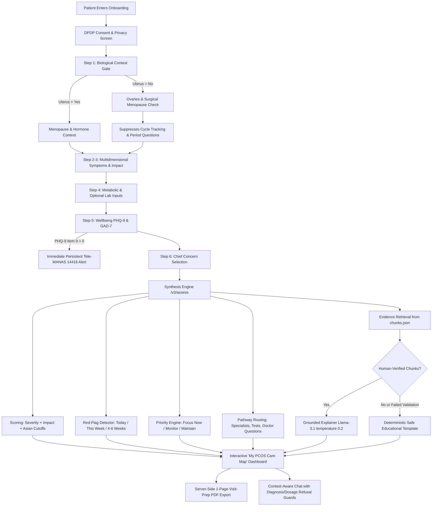

# 🌸 MahilaSakhi v3 – Context-Aware PCOS Care-Navigation Platform

MahilaSakhi is an evidence-informed, context-aware women's health platform that answers:
> **"Given MY symptoms, reproductive context, health info, goals, and concerns, what should I focus on next?"**

The platform replaces legacy single-form prediction with a validated **care-navigation pipeline**:
**Consent & DPDP Gate → Context Branching (Uterus/Ovaries/Menopause) → Multidimensional Profiling (Severity + Daily Impact) → Domain Prioritisation Engine → Tailored Care Pathway → Verified Guideline Grounding → Single-Page Clinical Visit-Prep Export.**

---

## 🚀 Key Capabilities (v3)

* 🛡️ **Consent & DPDP Act 2023 Compliance:** Zero persistent health logging, client-side session state, and one-click data deletion endpoint (`/v3/delete`).
* 🧭 **Context Gate Branching:** Dynamically handles hysterectomy, bilateral/unilateral oophorectomy, surgical vs. natural menopause, and hormonal contraception. Cycle tracking questions are suppressed when biologically not applicable.
* 🎯 **Domain Prioritisation & Care Pathways:** Ranks 7 core domains (*Androgen, Menstrual, Metabolic, Fertility, Mental Wellbeing, Sleep, Menopause/Cardiovascular*) into actionable tiers: **Focus now**, **Keep an eye on**, and **Maintain**.
* 🚨 **Red-Flag Escalation Engine:** Identifies acute symptoms and distinguishes rapid androgen changes or postmenopausal bleeding from standard PCOS with tiered clinical urgency (*Today*, *This week*, *In 4–6 weeks*).
* 📋 **Validated Psychological Instruments:** Optional **PHQ-9** and **GAD-7** screening with immediate and persistent safety alerts for Tele-MANAS (14416) if thoughts of self-harm are indicated.
* 📄 **Single-Page Visit-Prep PDF:** Server-side consultation summary export for structured discussions with healthcare providers.
* 💬 **Context-Grounded Care Map Chat:** Llama 3.1-powered conversational explanations strictly grounded in retrieved evidence chunks, with temperature 0.2 and strict refusal guards against diagnosis and drug prescribing.


---

## 🛠 Tech Stack

### Frontend

* React.js
* Chart.js
* HTML / CSS

### Backend

* Flask (Python)

### Machine Learning

* Scikit-learn
* Pandas
* NumPy

---

## 🧩 Care-Navigation System Architecture



---

## 🛡️ Clinical Safety & Regulatory Design

1. **Non-Diagnostic Imperative:** The app never diagnoses, prescribes, or calculates an arbitrary "PCOS probability" without pelvic ultrasound confirmation.
2. **Context Gate First:** Biological context strictly dictates clinical routing. Hysterectomy or natural/surgical menopause suppresses period tracking advice.
3. **Escalation & Cancer Rule-Out:** Rapidly worsening virilizing symptoms or postmenopausal vaginal bleeding immediately trigger clinical evaluation alerts to exclude androgen-secreting tumors or endometrial hyperplasia.
4. **Crisis Helplines:** If self-harm is indicated on PHQ-9 item 9, an un-dismissible emergency banner connects the patient to India's national crisis helpline (**Tele-MANAS: 14416**).
5. **India DPDP Act 2023 Compliance:** Health data is never persisted without consent; zero third-party analytics; all inputs live in client React state; one-click `/v3/delete` endpoint.
6. **Knowledge Base Verification Protocol:**
   Evidence chunks in `backend/knowledge/chunks.json` must be human-verified by a clinician before the LLM explainer is permitted to cite them:
   ```bash
   python scripts/verify_chunks.py
   ```
   Only an authorized clinician may flip `"verified": true` in `chunks.json`. If no verified chunks exist or if generation violates safety bounds, the system automatically falls back to deterministic templates.


---

## 📊 Input Health Indicators

The prediction model uses the following features:

* Age
* Weight
* BMI
* Weight Gain
* Cycle Irregularity
* Hair Growth
* Pimples / Acne
* Skin Darkening
* FSH Hormone Level
* Exercise / Lifestyle Indicator

---

## 🔬 Model Limitations & Honest Ablation Study

Early iterations of symptom prediction tools on this dataset frequently claimed an inflated **~98% diagnostic accuracy**. However, rigorous clinical audit reveals that high accuracy is driven almost entirely by **data leakage from transvaginal/pelvic ultrasound variables** (`Follicle No. (L)` and `Follicle No. (R)`).

When pelvic ultrasound findings are omitted, sensitivity/recall drops precipitously:

| Feature Subset | Number of Features | ROC-AUC | Accuracy | Precision | Recall (Sensitivity) |
|---|---|---|---|---|---|
| **Full Clinical Set (Ultrasound + Labs + Symptoms)** | 41 | **0.962** | 89.1% | 0.910 | **0.740** |
| **No Ultrasound (Labs + Symptoms only)** | 36 | 0.886 | 81.9% | 0.800 | 0.593 |
| **No Ultrasound & No Labs (Questionnaire only)** | 25 | 0.885 | 81.7% | 0.791 | 0.605 |
| **Symptoms Only (11 Basic History questions)** | 11 | 0.891 | 83.4% | 0.781 | 0.689 |

### Clinical Implications:
1. **No Ultrasound = No Risk Probability:** PCOS cannot be diagnosed from a questionnaire alone under the Rotterdam Criteria. MahilaSakhi v3 **refuses** to output an arbitrary probability without confirmed ultrasound follicle inputs, routing users to holistic care pathways instead.
2. **Probability Calibration:** The clinical Random Forest model (`model/pcod_clinical_v3.pkl`) uses Platt/Sigmoid probability calibration inside a 5-fold stratified cross-validation pipeline, achieving **ROC-AUC of 0.959**, **Recall of 81.9%**, and a low **Brier score of 0.0735**.
3. **Model Card:** Detailed dataset provenance, performance curves, and ethical bounds are documented in [`docs/model_card.md`](docs/model_card.md).

---

## 🖥 Application Interface

Main components:

* Health input dashboard
* PCOD prediction engine
* Health indicator chart
* AI chatbot assistant
* Diet recommendation panel

---

## ⚙️ How to Run the Project

### 1️⃣ Clone the repository

```
git clone https://github.com/YOUR_USERNAME/MahilaSakhi-PCOD-Predictor.git
cd MahilaSakhi-PCOD-Predictor
```

---

### 2️⃣ Start Backend (Flask)

```
cd backend
python app.py
```

Backend runs on:

```
http://127.0.0.1:5000
```

---

### 3️⃣ Start Frontend (React)

```
cd frontend
npm install
npm start
```

Frontend runs on:

```
http://localhost:3000
```

---

## 🎯 Future Improvements

Planned features:

* PCOD risk percentage score
* User login system
* Cycle tracking system
* AI-powered health assistant using LLM
* Cloud deployment

---

## 👩‍💻 Author

**Diya Malviya**

Computer Science Student
Passionate about **AI, HealthTech, and Full Stack Development**

---

## 💡 Inspiration

PCOD affects millions of women worldwide.
MahilaSakhi aims to combine **AI and healthcare awareness** to provide early insights and promote healthier lifestyles.

---

⭐ If you like this project, feel free to star the repository!
